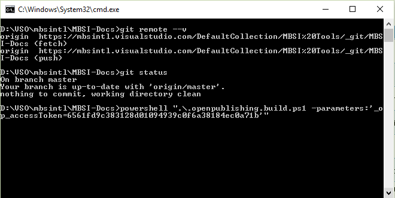
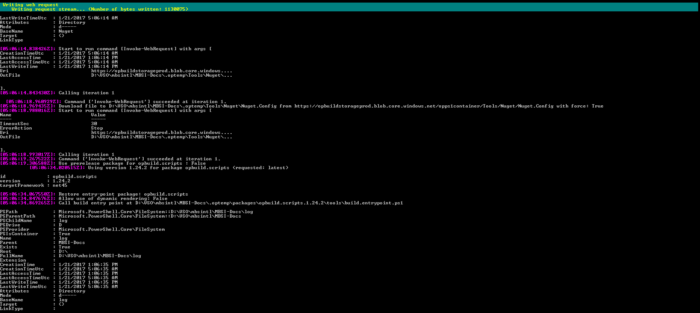
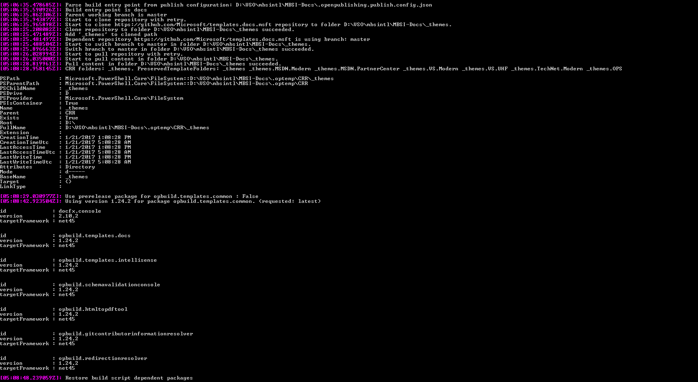
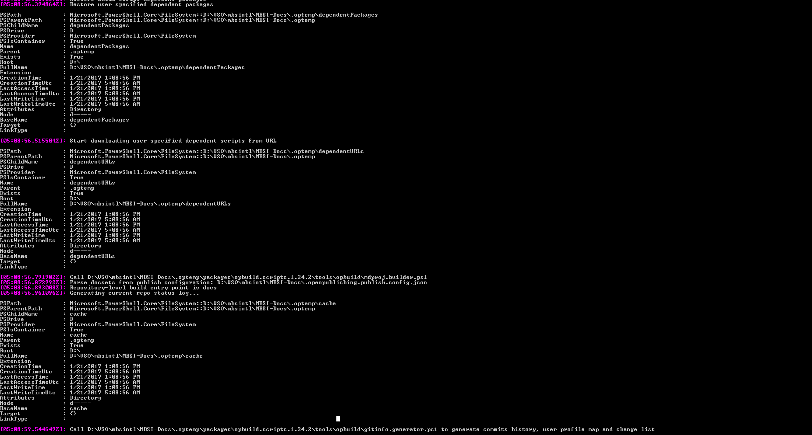
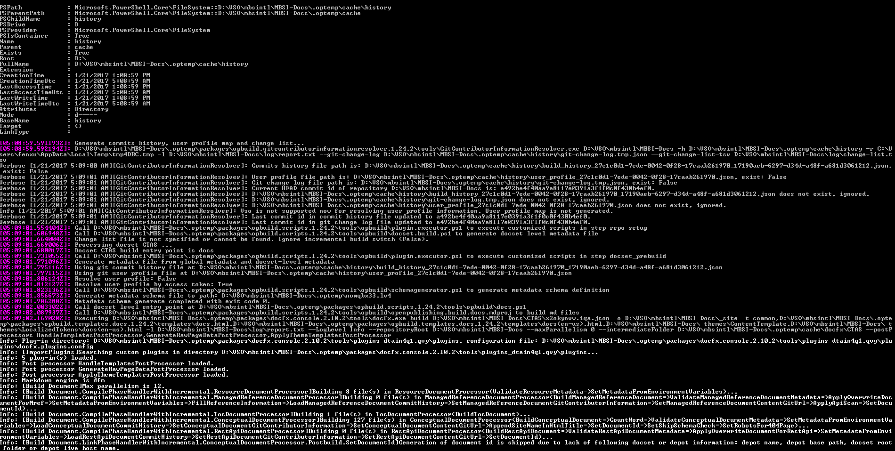
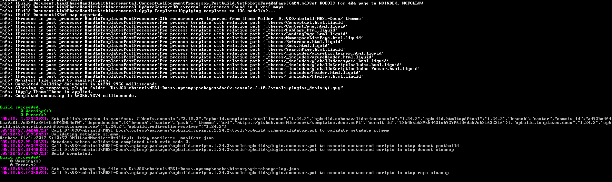

# Using cmd console to build MBSI-Docs on my machine
This is the steps that build MBSI-Docs locally with PAT.

## Step 1: show status and type in command

## Step 2: show build progress and result
  
  
  
  
  
  